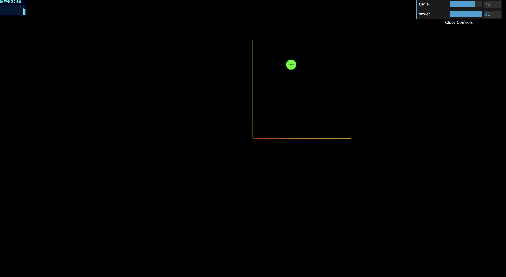
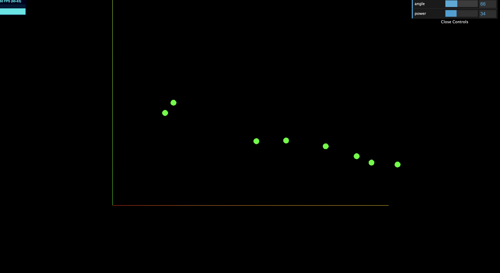

# Kinematic experiment

## To run the project:
```
> git clone git@github.com:officer47p/three-kinematic.git
> cd three-kinematic
> npm install
> npm run dev
```

## Pictures
| | |
|:-------------------------:|:-------------------------:|
|||

